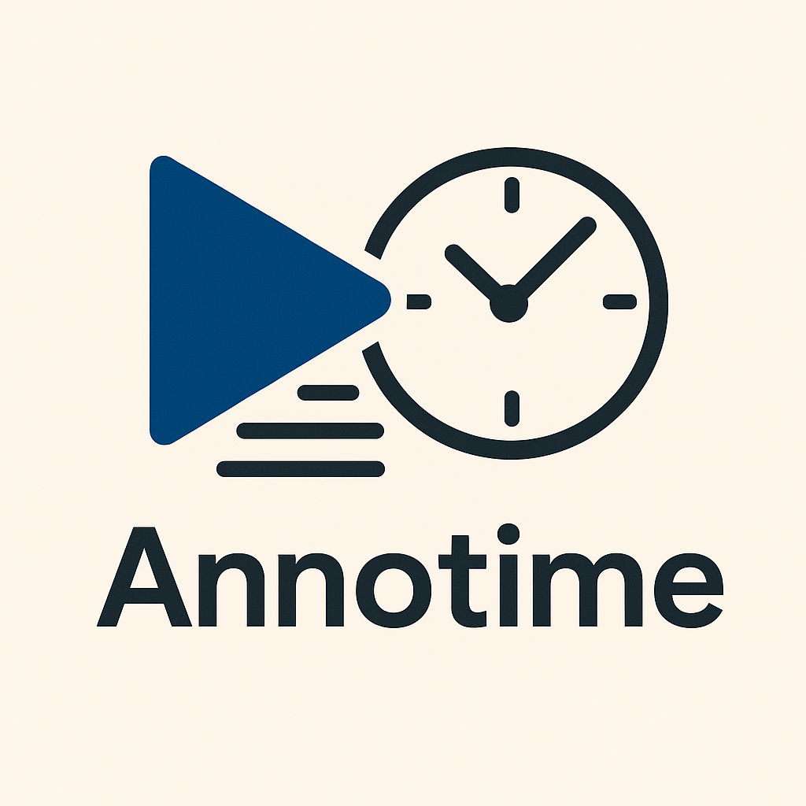
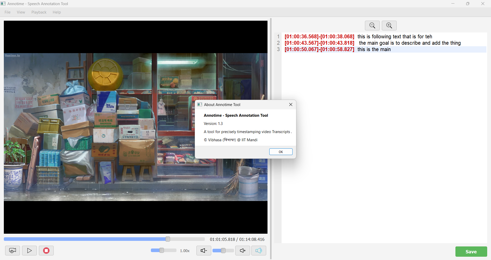

# Annotime - Speech Annotation Tool

Annotime is a desktop application designed for efficiently creating timestamped transcripts from video files. It provides a synchronized view of a video player and a text editor, allowing users to insert precise start and end timestamps directly into their notes using keyboard shortcuts.


## Features

* **Synchronized Playback:** Video player and text editor stay linked.
* **Precise Timestamping:** Insert `[HH:MM:SS.ms]-[HH:MM:SS.ms]` timestamps using a simple two-press shortcut (Ctrl+I).
* **Playback Controls:**
    * Play / Pause (Ctrl+Space)
    * Stop
    * Seek Forward/Backward (Alt + Right/Left Arrow, 5 seconds)
    * Clickable Timeline: Seek by clicking directly on the video progress bar.
    * Variable Playback Speed: Adjust speed using a slider (0.5x, 0.75x, 1.0x, 1.25x, 1.5x, 2.0x).
    * Volume Control & Mute.
* **Playback Looping:** Loop the last N seconds of playback (Ctrl+L to toggle, interval configurable via menu).
* **Text Editor:**
    * Line numbers for easy reference.
    * Basic text editing capabilities.
    * Font size adjustment (Zoom In/Out buttons).
    * Word Wrap toggle (View menu).
    * Clickable Timestamps: Click on a timestamp in the editor to seek the video to that time.
* **File Management:**
    * Load Video (Supports common formats like MP4, MKV, AVI, MOV, WMV etc.).
    * Load/Save/Save As Transcript (.txt format).
* **Session Persistence:** Remembers the last opened video/transcript files and playback position for the next launch.
* **Auto-Save:** Automatically saves the transcript periodically (every 30 seconds) if a file path is set and changes have been made.
* **Configurable Auto-Pause:** Optionally enable/disable automatic video pausing when inserting a timestamp (Playback menu).
* **Help Menu:** Includes keyboard shortcuts reference and basic application info.
For Reference screenshot of the tool is attached below.

## Requirements

1.  **Python:** Version 3.7+ recommended.
2.  **VLC Media Player:** **Crucially, you MUST have VLC Media Player installed** on your system (Version 3.x.x, 64-bit recommended if using 64-bit Python). The application relies on your system's VLC installation for video playback. Download from [VideoLAN official website](https://www.videolan.org/vlc/).
3.  **Python Libraries:**
    * `PyQt5`
    * `python-vlc`

## Installation & Setup

1.  **Clone the Repository:**
    ```bash
    git clone [https://github.com/your-username/Annotime.git](https://github.com/your-username/Annotime.git) # Replace with your repo URL
    cd Annotime
    ```
2.  **Install VLC:** Make sure VLC Media Player (3.x) is installed on your system and accessible in your system's PATH (usually handled by the VLC installer).
3.  **Create a Virtual Environment (Recommended):**
    ```bash
    python -m venv venv
    # Activate it:
    # Windows: .\venv\Scripts\activate
    # Linux/macOS: source venv/bin/activate
    ```
4.  **Install Python Dependencies:**
    ```bash
    pip install PyQt5 python-vlc
    # Or if you create a requirements.txt:
    # pip install -r requirements.txt
    ```

## Usage

1.  Make sure your virtual environment is activated (if you created one).
2.  Navigate to the application's directory (e.g., `Annotime/speech_annotation_tool/`).
3.  Run the main script:
    ```bash
    python main.py
    ```
4.  **Workflow:**
    * Use "File" -> "Load Video..." to open a video file.
    * Use "File" -> "Load Transcript..." or start typing in the right-hand panel.
    * Use the playback controls (buttons, slider, shortcuts) to navigate the video.
    * Press `Ctrl+I` once at the start of a speech segment. This inserts `[START_TIME]-`.
    * Type the corresponding transcript text.
    * Press `Ctrl+I` again at the end of the segment. This inserts `[END_TIME] ` after the start marker. The cursor moves to the end of the line.
    * Use "File" -> "Save Transcript" or "Save Transcript As..." (`Ctrl+S`, `Ctrl+Shift+S`) to save your work.

## Keyboard Shortcuts

* **`Ctrl + I`**: Insert Timestamp (Start/End Pair)
* **`Ctrl + L`**: Loop Last N Seconds (Toggle)
* **`Ctrl + Space`**: Play / Pause Video
* **`Alt + Right Arrow`**: Seek Forward 5 Seconds
* **`Alt + Left Arrow`**: Seek Backward 5 Seconds
* **`Ctrl + S`**: Save Transcript
* **`Ctrl + Shift + S`**: Save Transcript As...
* **`Ctrl + Q` / `Cmd + Q`**: Exit Application
* **`Mouse Click on Timestamp`**: Seek Video to Timestamp

*(See Help -> Keyboard Shortcuts within the app for a reminder)*

## Building from Source (Optional)

You can create standalone executables using PyInstaller.

1.  Install PyInstaller: `pip install pyinstaller`
2.  Ensure **VLC Media Player** is installed on the build machine (and target machine, unless you attempt complex bundling).
3.  Run from the `speech_annotation_tool` directory:
    * **Folder Output:** `pyinstaller --name Annotime --windowed --add-data "icons:icons" main.py`
    * **Single File Output:** `pyinstaller --name Annotime --onefile --windowed --add-data "icons:icons" main.py`
4.  The executable/folder will be in the `dist` directory. Remember the VLC runtime dependency!

## Contributing

Contributions are welcome! Please feel free to submit pull requests or open issues. 

## License


This project is licensed under the MIT License